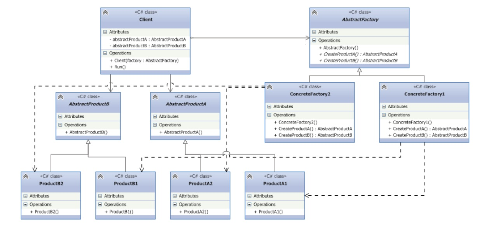

## Домашнее задание №4 (паттерн проектирования Abstract Factory)

### Постановка технического задания:

Вы разрабатываете приложение по заказу такси. Пользователи приложения должны иметь возможность при
заказе выбирать различные варианты такси: легковое; грузовое; мотоцикл, гужевую повозку. При этом
каждым транспортным средством имеет право управлять определенный тип водителя (кучер / байкер /
гонщик / дальнобойщик) и каждый автомобиль имеет определенную модель передвижения (скачет / мчит /
тащится / едет). То есть, различные варианты Заказа такси определяется комплексом признаков (кто им
управляет и как оно едет). Например, гужевая повозка должна «скакать» и ей должен управлять кучер, а
грузовое такси должно «тащиться», а управлять им должен дальнобойщик.

### Примечание:

Сущность **водитель и способ передвижения** транспортного средства **являются взаимосвязанными** и
используются в комплексе, то есть **они и определяют тип заказанного клиентом такси**. Так, например,
Заказ грузового такси подразумевает, что будет создан объект, в котором в качестве водителя будет
Дальнобойщик и оно будет «тащиться». Всё вышеизложенное – довод в пользу использования абстрактной
фабрики. Вам нужно абстрагировать создание такси от самого класса такси, чтобы создать более гибкую
архитектуру.

Отметим и недостатки шаблона (не переживайте – это плата за удобство). В частности, если нам захочется
добавить в класс Заказ новую характеристику, например, ДопУслуга (затычка в нос у гужевой повозки / шлем
для мотоцикла и т. д.), то придется переделывать классы фабрик и класс Заказ. Поэтому возможности по
расширению в данном паттерне имеют некоторые ограничения.

### Подсказка:

#### Паттерн определяет следующих участников:

- Абстрактные классы **`AbstractProductA`** и **`AbstractProductB`** определяют интерфейс для классов, объекты
которых будут создаваться в программе. **В нашем случае это классы Водитель и Движение**;

- Конкретные классы **`ProductA1`** / **`ProductA2`** и **`ProductB1`** / **`ProductB2`** представляют конкретную реализацию
абстрактных классов. **У нас это конкретные типы водителей и конкретные способы передвижения**.

- Абстрактный класс фабрики **`AbstractFactory`** определяет методы для создания объектов. Причем методы
возвращают абстрактные продукты, а не их конкретные реализации. **У нас это ФабрикаТакси - класс
возвращающий абстрактного Водителя и абстрактный способ Двидения**.

- Конкретные классы фабрик **`ConcreteFactory1`** и **`ConcreteFactory2`** реализуют абстрактные методы базового
класса и непосредственно определяют какие конкретные продукты использовать. **У нас это
ФабрикаГрузовогоТакси, ФабрикаМотоТакси и пр**.

- Класс клиента **`Client`** использует класс фабрики для создания объектов. При этом он использует исключительно
абстрактный класс фабрики **`AbstractFactory`** и абстрактные классы продуктов **`AbstractProductA`** и
**`AbstractProductB`** и никак не зависит от их конкретных реализаций. **У нас это Заказ, который принимая
конкретную фабрику сможет предоставить «комплексный» объект**.
